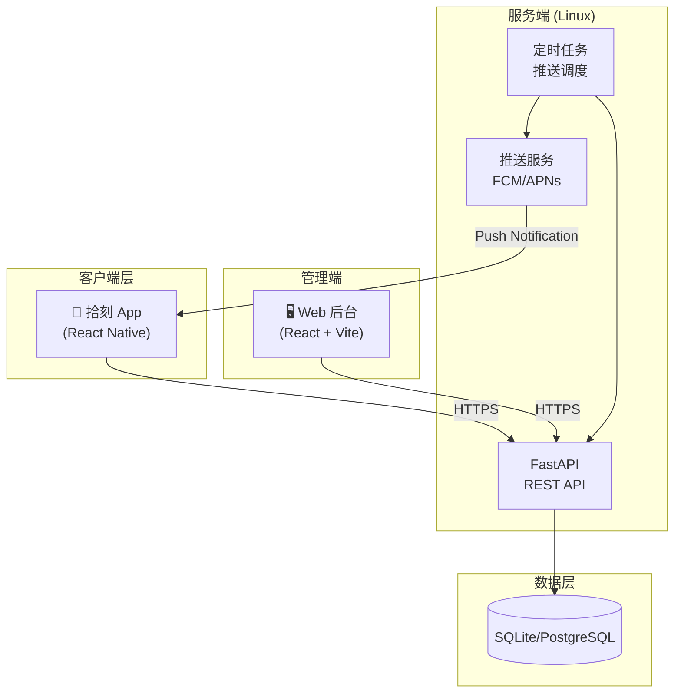
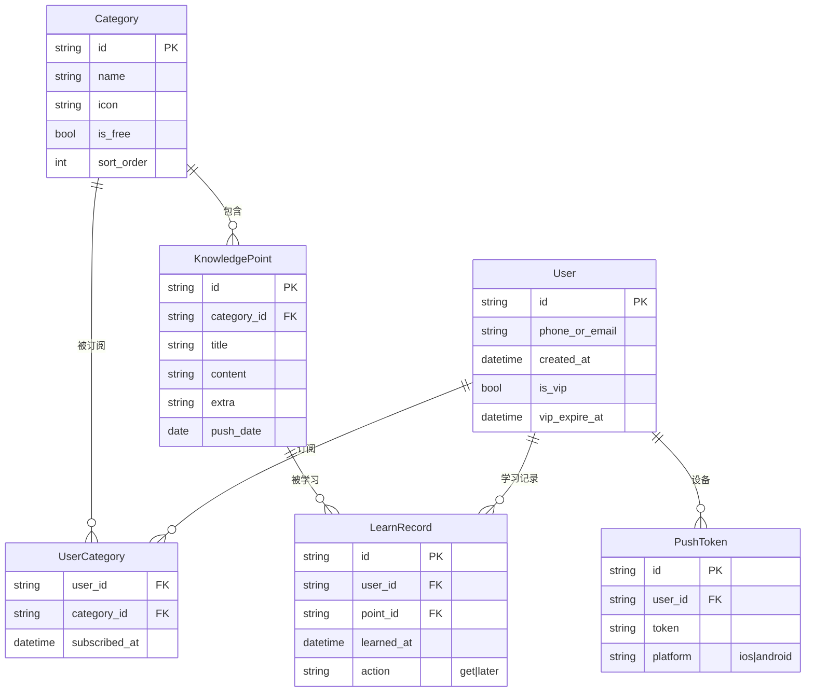
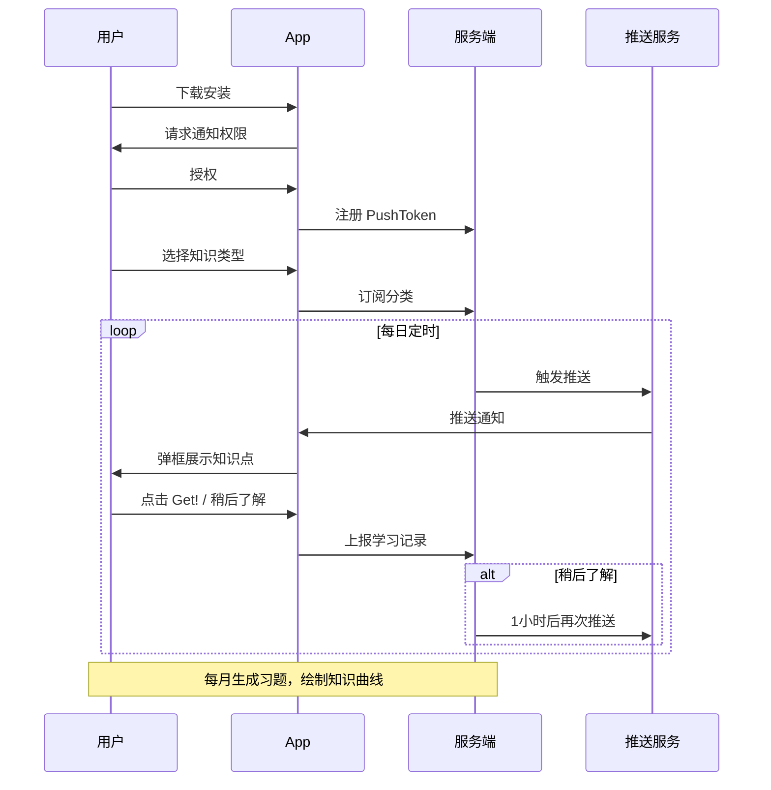
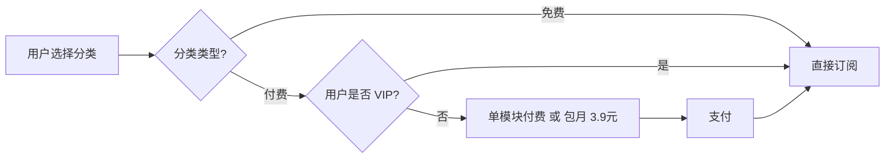

# 拾刻 - 架构设计文档

## 1. 产品概述

**拾刻** 是一款极简主义微学习 App，通过每天定时推送一个知识点，让用户在碎片化时间内轻松完成学习，培养终身学习的微习惯。

## 2. 系统架构图



## 3. 核心数据模型



## 4. 交互流程图



## 5. 技术选型

| 模块 | 技术 | 说明 |
|------|------|------|
| 后端 API | FastAPI | 高性能、异步、自动文档 |
| 数据库 | SQLite (开发) / PostgreSQL (生产) | 轻量部署 |
| 定时任务 | APScheduler | 内置调度，无需额外组件 |
| 推送 | Firebase Cloud Messaging | 支持 Android/iOS |
| Web 后台 | React + Vite + Ant Design | 管理知识点 CRUD |
| 移动端 | React Native + Expo | 跨平台，JS 技术栈 |

## 6. 目录结构

```
daydayup/
├── backend/          # Python 后端
│   ├── app/
│   │   ├── api/      # 路由
│   │   ├── models/   # 数据模型
│   │   ├── services/ # 业务逻辑
│   │   └── core/     # 配置
│   └── requirements.txt
├── admin/            # Web 后台
│   └── src/
├── mobile/           # 移动端 App
│   └── app/
├── docs/             # 文档
└── README.md
```

## 7. 商业化逻辑


